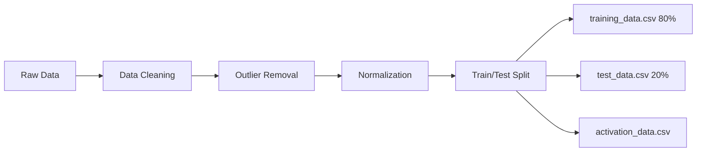

# 📈 Event-Based Market Prediction System

**AI-CPS Architecture | ANN & OLS Regression Models**

An intelligent system for predicting financial market prices using Artificial Neural Networks (ANN) and Ordinary Least Squares (OLS) regression, deployed as a containerized AI-Cyber-Physical System.

> **Course**: M. Grum: Advanced AI-based Application Systems (AIBAS)  
> **Institution**: University of Potsdam  
> **Team**: Shashank Sanjay Kalaskar, Aruna Ravi Kasturi Rama Mohan Babu

---

## 🎯 Project Overview

This project implements an **event-driven market prediction system** that forecasts closing market prices based on:

- 📊 Economic signals and volatility indicators
- 🌍 Geopolitical risk scores
- 💬 Market sentiment analysis
- 📉 Macro-economic events (Federal Rate changes, economic news)

### Architecture Highlights

The system follows the **AI-CPS (Cyber-Physical System)** architecture with four core components:

```
┌─────────────────┐    ┌──────────────────┐    ┌─────────────────┐    ┌──────────────┐
│  LearningBase   │───▶│  KnowledgeBase   │───▶│ ActivationBase  │───▶│   CodeBase   │
│  Model Training │    │  Model Storage   │    │   Data Input    │    │  Prediction  │
└─────────────────┘    └──────────────────┘    └─────────────────┘    └──────────────┘
```

**Components:**
- **LearningBase**: Model training and validation
- **KnowledgeBase**: Trained model artifacts storage (`.h5`, `.pkl`)
- **ActivationBase**: Real-time data ingestion
- **CodeBase**: Orchestration and prediction execution

---

## 🧠 Models Implemented

### 1️⃣ Artificial Neural Network (ANN)

**Framework**: TensorFlow / Keras  
**Architecture**:
- Input Layer: 15 features
- Hidden Layers: 256 → 128 → 64 neurons
- Output Layer: 1 neuron (Close_Price prediction)
- Activation: ReLU
- Regularization: L2 (0.0005), Dropout (0.25-0.35), Batch Normalization

**Optimization**:
- Optimizer: Adam (lr=0.0007)
- Loss: Mean Squared Error (MSE)
- Callbacks: Early Stopping, ReduceLROnPlateau

### 2️⃣ Ordinary Least Squares (OLS)

**Framework**: Statsmodels  
**Purpose**: Interpretable linear baseline for comparison  
**Features**: 15 + constant term

---

## 📊 Dataset

**Source**: `Market_Trend_External.csv`  
**Type**: Financial time-series  
**Rows**: 24,000+  
**Target Variable**: `Close_Price`

### Features

| Feature | Description |
|---------|-------------|
| `Date` | Market trading date |
| `Open_Price` | Opening price |
| `Close_Price` | **Target**: Closing price |
| `High_Price` | Daily high |
| `Low_Price` | Daily low |
| `Volume` | Trading volume |
| `Daily_Return_Pct` | Daily return percentage |
| `Volatility_Range` | Market volatility indicator |
| `VIX_Close` | VIX fear index |
| `Economic_News_Flag` | Binary: Major economic event |
| `Sentiment_Score` | Market sentiment score |
| `Federal_Rate_Change_Flag` | Binary: Interest rate change |
| `GeoPolitical_Risk_Score` | Geopolitical risk level |
| `Currency_Index` | Global currency index |

### Engineered Features

- `Price_Range` = High_Price - Low_Price
- `Return_Volatility` = Daily_Return_Pct × Volatility_Range
- `Volume_Impact` = Volume × Daily_Return_Pct

---

## 🧪 Data Pipeline



**Output Files** (in `/data`):
- `training_data.csv` - 80% for model training
- `test_data.csv` - 20% for model evaluation
- `activation_data.csv` - Single unseen row for inference
- `joint_data_collection.csv` - Complete processed dataset

---

## 📈 Model Performance

| Model | RMSE | R² | Error (%) |
|-------|------|----|-----------| 
| **ANN** | 0.001067 | 0.999978 | ~1.8% |
| **OLS** | 0.004719 | 0.999568 | ~3.8% |

**Test Prediction** (activation_data.csv):

| Metric | Value |
|--------|-------|
| Actual Close_Price | 11.62 |
| ANN Prediction | 11.41 |
| OLS Prediction | 11.18 |

✅ Both models demonstrate excellent predictive accuracy with the ANN slightly outperforming OLS.

---

## 🚀 Quick Start

### Prerequisites

- Docker & Docker Compose
- Python 3.10+ (for local training)
- Git

### Installation

```bash
# Clone the repository
git clone https://github.com/arunaravikasturi/AIBAS_Event_Based_Market_Prediction_system.git
cd AIBAS_Event_Based_Market_Prediction_FINAL
```

---

## 🎓 Training Models (Local)

### 1. Train the ANN Model

Open and run `code/models/AI_Model.ipynb`:

```python
# Trains ANN model and saves:
# - currentAiSolution.h5 (model)
# - scaler.pkl (feature scaler)
# - ann_metrics.csv (performance)
```

### 2. Train the OLS Model

Open and run `code/models/OLS_Model.ipynb`:

```python
# Trains OLS model and saves:
# - currentOlsSolution.pkl (model)
# - ols_features.pkl (feature list)
```

**Outputs**: All artifacts saved to `code/models/`

---

## 🐳 Docker Deployment

### Architecture Overview

```
📦 docker_images/
├── activationBase/    # Data ingestion container
├── learningBase/      # Training data provider
├── knowledgeBase/     # Model storage (currentAiSolution.h5, currentOlsSolution.pkl, etc.)
└── codeBase/          # Prediction engine (run_prediction.py)
```

### Run ANN Scenario

```bash
cd scenarios/apply_ann
docker compose up
```

**Expected Output:**
```
==================================================
=== FINAL PREDICTIONS ===
==================================================
 ANN_Prediction  OLS_Prediction
      11.408615       11.180423
==================================================
✓ Prediction pipeline completed successfully!
==================================================
```

### Run OLS Scenario

```bash
cd scenarios/apply_ols
docker compose up
```

### Docker Images

Pre-built images available on Docker Hub:

```bash
docker pull shashankk5/event-based-market-activation
docker pull shashankk5/event-based-market-learning
docker pull shashankk5/event-based-market-knowledge
docker pull shashankk5/event-based-market-code
```

---

## 📁 Project Structure

```
AIBAS_Event_Based_Market_Predictor/
├── code/
│   └── models/
│       ├── AI_Model.ipynb              # ANN training notebook
│       ├── OLS_Model.ipynb             # OLS training notebook
│       ├── currentAiSolution.h5        # Trained ANN model
│       ├── currentOlsSolution.pkl      # Trained OLS model
│       ├── scaler.pkl                  # Feature scaler
│       └── ols_features.pkl            # OLS feature list
├── data/
│   ├── Market_Trend_External.csv       # Raw dataset
│   ├── training_data.csv               # 80% training set
│   ├── test_data.csv                   # 20% test set
│   ├── activation_data.csv             # Inference input
│   └── joint_data_collection.csv       # Complete dataset
├── docker_images/
│   ├── activationBase/
│   │   ├── Dockerfile
│   │   └── activation_data.csv
│   ├── learningBase/
│   │   ├── Dockerfile
│   │   └── data/
│   │       ├── train/training_data.csv
│   │       └── validation/test_data.csv
│   ├── knowledgeBase/
│   │   ├── Dockerfile
│   │   └── models/
│   │       ├── currentAiSolution.h5
│   │       ├── currentOlsSolution.pkl
│   │       ├── scaler.pkl
│   │       └── ols_features.pkl
│   └── codeBase/
│       ├── Dockerfile
│       ├── requirements.txt
│       └── run_prediction.py           # Prediction orchestration
├── scenarios/
│   ├── apply_ann/
│   │   └── docker-compose.yml
│   └── apply_ols/
│       └── docker-compose.yml
├── documentation/
│   ├── ann_actual_vs_predicted_real.png
│   ├── ols_actual_vs_predicted.png
│   └── (other diagnostic plots)
├── .gitignore
├── LICENSE
└── README.md
```

---

## 🛠️ Technologies & Tools

| Category | Tools |
|----------|-------|
| **ML Frameworks** | TensorFlow, Keras, Statsmodels |
| **Data Processing** | Pandas, NumPy, Scikit-learn |
| **Visualization** | Matplotlib, Seaborn |
| **Containerization** | Docker, Docker Compose |
| **Development** | Jupyter Notebook, Python 3.10 |
| **Version Control** | Git, GitHub |

---

## 🔬 Model Diagnostics

### ANN Diagnostics
- ✅ Low residual variance
- ✅ Normal Q-Q plot shows good fit
- ✅ No significant outliers (Cook's distance)

### OLS Diagnostics
- ✅ Linear relationship confirmed
- ✅ Homoscedasticity verified
- ✅ Residuals approximately normal

**Plots available in**: `/documentation/`

---

## 🧩 Pipeline Workflow

### Training Phase
1. **Data Scraping & Cleaning** → `Market_Trend_External.csv`
2. **Feature Engineering** → Create derived features
3. **Normalization & Split** → 80/20 train/test
4. **Model Training** → ANN & OLS
5. **Evaluation** → RMSE, R², diagnostics
6. **Artifact Export** → `.h5`, `.pkl` files

### Deployment Phase
1. **activationBase** → Loads `activation_data.csv`
2. **learningBase** → Provides training metadata
3. **knowledgeBase** → Loads models & scalers
4. **codeBase** → Executes `run_prediction.py`
   - Feature engineering
   - Scaling
   - ANN prediction
   - OLS prediction
   - Output to `/tmp/output/predictions.csv`

---

## 📝 Key Features

✅ **Event-Driven Architecture** - Reacts to market signals  
✅ **Dual Model Comparison** - ANN (accuracy) vs OLS (interpretability)  
✅ **Containerized Deployment** - Reproducible AI-CPS system  
✅ **Comprehensive Logging** - Verbose prediction pipeline  
✅ **Production-Ready** - Docker Hub images, clean separation of concerns  
✅ **Academic Rigor** - Full documentation, diagnostics, evaluation  

---

## 👥 Contributors

| Name | Role | GitHub |
|------|------|--------|
| **Shashank Sanjay Kalaskar** | ML Engineer, DevOps | [@shashank237](https://github.com/shashank237) |
| **Aruna Ravi Kasturi Rama Mohan Babu** | Data Scientist, Model Developer | [@arunaravikasturi](https://github.com/arunaravikasturi) |

**University of Potsdam**  
Faculty of Business, Information Systems  
Chair of AI-based Application Systems

---

## 📜 License

This project is licensed under the **GNU Affero General Public License v3.0 (AGPL-3.0)**.

See the [LICENSE](LICENSE) file for full details.

---

## 🙏 Acknowledgments

This project was developed as part of the course:  
**"Advanced AI-based Application Systems (AIBAS)"**  
taught by **Prof. Dr. M. Grum**  
at the **University of Potsdam**.

Special thanks to the course instructors for their guidance on AI-CPS architectures and containerized ML deployment.

---

## 📞 Contact

For questions or collaboration:
- **GitHub Issues**: [Submit an issue](https://github.com/shashank237/AIBAS_Event_Based_Market_Prediction_FINAL/issues)
- **Email**: Contact via GitHub profile

---

## 🔗 Links

- [Docker Hub Images](https://hub.docker.com/u/shashankk5)
- [University of Potsdam](https://www.uni-potsdam.de/)
- [Course Website](https://www.uni-potsdam.de/de/wi-grum)

---

<div align="center">

**⭐ Star this repository if you found it helpful!**

Made with ❤️ at University of Potsdam

</div>
